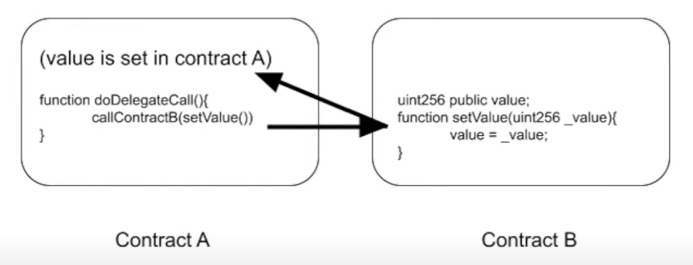
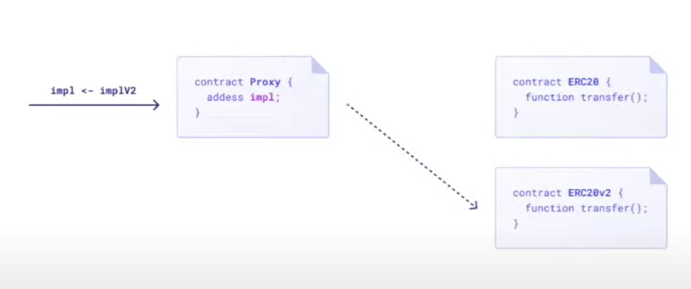
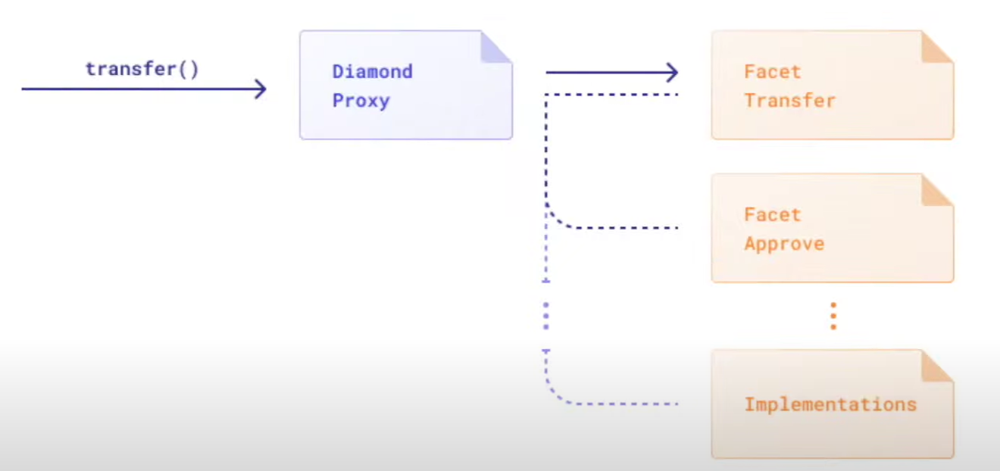

# Upgradeable Smart Contracts

- Upgradeable smart contracts allow developers to modify or extend the functionality of deployed contracts without disrupting the existing system or requiring users to interact with a new contract address.
- This is achieved by separating the contract's logic and storage, enabling updates to the logic while preserving the contract's state and user interactions.

## Reasons to Use Upgradeable Smart COntracts

- **Bug Fixes and Security Patches**: Developers can address vulnerabilities or bugs discovered after deployment without requiring users to switch to a new contract.
- **Feature Enhancements**: New features or improvements can be added seamlessly as decentralized applications (dApps) evolve.
- **Regulatory Compliance**: Contracts can be updated to ensure ongoing compliance with changing regulations.
- **Improved User Experience**: Users can continue interacting with the same contract address, avoiding confusion and potential loss of funds associated with contract migrations.

## Various Ways to Upgrade/Update a Smart Contract

### Parameterization

Parameterization is a method of designing contracts with adjustable parameters. Changes to these parameters can be made without altering the contract code. i.e. having setter functions for some storage variables which can help alter the behavior of the smart contract.

```solidity
uint256 private rateOfInterest;

function setRoI(uint256 _roi) external {
    rateOfInterest = _roi;
}
```

When the `setRoi` function is called, it would change the rateOfInterest value the contract would use internally in the embedded logic.

**Advantages**:

- Simplest way to upgrade the smart contract.

**Limitations**:

- The logic of the smart contract cannot be changed.
- New storage variables cannot be added.
- Limited flexibility and leads to complex and inefficient contract design.

### Social Migration

The new contract is not connected to the old contract in anyway. A new contract version is deployed and the consumers are encouraged to voluntarily migrate to the new contract.

**Advantages**:

- Fully decentralized and transparent.
- Easiest to audit.
- No central authority required for upgrades.

**Limitations**:

- Risk of user fragmentation.
- Coordination challenges.
- Potential loss of user funds during migration.
- Different contract address between the versions.

### Leveraging Proxy Pattern

Proxies are considered the truest form of upgrades. Proxies leverage the `delegateCall` function which is identical to the message `call` function with the difference that the code at the target address is executed in the context of the calling contract and `msg.sender` and `msg.value` do not change their values.



The **proxy pattern** is the most common approach for creating upgradeable smart contracts. It involves:

- **Proxy Contract**: Stores the system's state and a changeable logic address. Proxy contract sits on top of the implementation contract.
- **Implementation/Logic Contract**: Contains the main code and functionality. Whenever we need to upgrade, we implement a brand new implementation contract.
- **User**: The users call the proxy contracts.
- **Admin**: This is the user (or group of users) who upgrade to the newer implementation contracts.

Users interact with the proxy, which forwards calls to the logic contract.

**NOTE**: The proxy contract holds ALL the state variables.



#### Types of Proxy Patterns

##### Transparent Proxy Pattern

In this pattern,

- Admins cannot call the implementation contract functions and can ONLY call admin contract functions.
- Users cannot call the admin contract functions and can call ONLY implementation contract functions.

+------------------+        +------------------------+
|   Proxy Contract |        | Implementation Contract|
|------------------|        |------------------------|
| - address impl   |------->| - Business Logic       |
| - address admin  |        | - State Variables      |
|                  |        |                        |
| - fallback()     |        |                        |
| - receive()      |        |                        |
| - upgradeTo()    |        |                        |
+------------------+        +------------------------+
         ^
         |
         |
         |
    +----------+
    |  Caller  |
    +----------+

The Transparent Proxy pattern provides a robust solution for upgradeable smart contracts by addressing the function selector clash issue and clearly separating admin and user functionalities. It's widely used in production environments and supported by popular frameworks like OpenZeppelin.

**How it Works?**

- The proxy contract interprets function calls based on the caller's address (msg.sender):
  - If the caller is an admin, the proxy executes its own functions (e.g. upgrade functions)
  - If the caller is a non-admin user, the proxy always delegates the call to the implementation contract
- This approach prevents function selector clashes between the proxy and implementation contracts.

##### Universal Upgradeable Policy (UUPS) Pattern

UUPS is an upgradeable smart contract pattern that aims to address some of the limitations of the Transparent Proxy pattern. It was proposed by EIP-1822 and has gained popularity due to its gas efficiency and simplified proxy structure.

**Key Features of UUPS**:

- **Upgrade Logic in Implementation**: Unlike the Transparent Proxy pattern, UUPS moves the upgrade logic to the implementation contract.
- **Gas Efficiency**: UUPS proxies are more gas-efficient to deploy compared to Transparent Proxies.
- **Simplified Proxy**: The proxy contract in UUPS is simpler, as it doesn't need to handle upgrade logic or admin functions.
- **Consistent Interface**: The upgrade interface remains consistent across different implementations.

**How it Works?**

1. The proxy contract contains only the bare minimum logic to delegate calls to the implementation contract.
2. The implementation contract includes the upgrade logic (usually through inheritance from a standard upgradeable contract).
3. When an upgrade is needed, the upgrade function in the implementation contract is called, which updates the implementation address in the proxy's storage.

+------------------+        +------------------------+
|   Proxy Contract |        | Implementation Contract|
|------------------|        |------------------------|
| - address impl   |------->| - Business Logic       |
|                  |        | - Upgrade Logic        |
| - fallback()     |        | - State Variables      |
|   {delegatecall} |        |                        |
+------------------+        +------------------------+
         ^                             |
         |                             |
         |      +------------------+   |
         +------| User Interactions|   |
                +------------------+   |
                                       |
                                       v
                            +----------------------+
                            | New Implementation   |
                            |----------------------|
                            | - Updated Logic      |
                            | - Upgrade Logic      |
                            | - State Variables    |
                            +----------------------+

##### Diamond Pattern



**Key Features of the Diamond Pattern**:

- **Multiple Implementation Contracts**: Unlike traditional proxy patterns that use a single implementation contract, the Diamond pattern allows a single proxy to interact with multiple implementation contracts called "facets".
- **Modular Design**: Functionality is distributed across dedicated facets, enabling more flexible and scalable contract architecture.
- **Bypass Size Limits**: By breaking down large contracts into smaller facets, the Diamond pattern overcomes the 24KB contract size limit on Ethereum.
- **Partial Upgrades**: Developers can add, replace, or remove specific functions without affecting the entire contract.
Shared State: Different facets of a Diamond proxy can share internal functions, libraries, and state variables.

**How it Works?**

1. The Diamond proxy contract contains a mapping of function selectors to facet addresses.
2. When a function is called on the proxy, it routes the call to the appropriate facet using the selector mapping.
3. A mandatory diamondCut() function allows for adding, removing, or replacing facets and functions.

#### Major Concerns Around Proxy Contracts

##### Storage Clashes

Storage clashes are a significant security concern in upgradeable smart contracts, particularly when using proxy patterns. Storage clashes occur when the storage layout of the proxy contract conflicts with that of the implementation contract. In Ethereum and similar blockchains, contract storage variables are stored in specific slots, indexed starting from zero.

When a storage clash happens, it can lead to:

- Data corruption
- Unexpected behavior
- Security vulnerabilities
- Loss of funds or critical information

**How Storage Clashes Occur**:

Storage clashes typically happen in two scenarios:

- **Proxy and Implementation Conflict**: When the proxy and implementation contracts use the same storage slots for different variables.
- **Upgrade Mismanagement**: When an upgraded implementation contract changes the order or structure of storage variables.

**Preventing Storage Clashes**:

To prevent storage clashes, developers should follow these best practices:

- **Use Standardized Patterns**: Utilize well-established proxy patterns like OpenZeppelin's Upgradeable Contracts, which include built-in safeguards against storage clashes4.
- **Storage Gaps**: Implement storage gaps in both proxy and implementation contracts to allow for future variable additions without disrupting existing storage layouts3.
- **Append-Only Updates**: When upgrading, only append new variables to the end of existing ones. Never insert new variables between existing ones or change their order4.
- **Thorough Testing**: Implement comprehensive tests that verify storage layouts across upgrades.
- **Use Storage Layout Tools**: Employ tools that can analyze and compare storage layouts between contract versions.
- **Unstructured Storage Pattern**: For critical variables in the proxy (like the implementation address), use unstructured storage patterns to avoid conflicts with the implementation contract1.

##### Function Selector Clashes

Function selector clashes occur when different functions in the proxy and implementation contracts have the same function selector. In Solidity, each function is identified by a unique selector, which is the first four bytes of the Keccak-256 hash of the function's signature.

When a function selector clash occurs, it can lead to:

- Unexpected behavior
- Security vulnerabilities
- Incorrect function execution

**How Function Selector Clashes Occur**:

Function selector clashes typically happen in two scenarios:

- **Proxy and Implementation Conflict**: When the proxy and implementation contracts have functions with the same selector.
- **Upgrade Mismanagement**: When an upgraded implementation contract introduces a function with a selector that conflicts with an existing proxy function.

**Preventing Function Selector Clashes**:

To prevent function selector clashes, developers should follow these best practices:

- **Use Transparent Proxy Pattern**: This pattern, popularized by OpenZeppelin, helps mitigate selector clashes by implementing different logic for admin functions and user functions4.
- **Careful Naming**: Avoid using the same function names in proxy and implementation contracts, even with different parameters.
- **Selector Checks**: Implement checks in the proxy to ensure that selectors don't clash during upgrades.
- **Thorough Testing**: Implement comprehensive tests that verify function selectors across all contracts and upgrades.
- **Use Upgrade Libraries**: Utilize well-tested upgrade libraries like OpenZeppelin's that include built-in safeguards against selector clashes.
- **UUPS Pattern**: Consider using the Universal Upgradeable Proxy Standard (UUPS) pattern, which moves upgrade logic to the implementation contract, reducing the risk of selector clashes1.